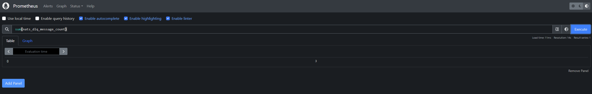

Surveyor compose and dashboards from https://github.com/nats-io/nats-surveyor.


# Monitoring DLQ at NATs 

NATs DLQ could be monitored by Vector consuming stream subscribed to [`MAX_DELIVERIES` advisory](https://docs.nats.io/running-a-nats-service/nats_admin/monitoring/monitoring_jetstream#advisories). 
Vector exposes `/metrics` endpoint scraped by Prometheus which could be set to alert manager. 

### Vector configuration
See [prometheus_exporter.yaml](vector/prometheus_exporter.yaml)

Metrics could be tested by 
```
curl localhost:19090/metrics
# HELP nats_dlq_message_count nats_dlq_message_count
# TYPE nats_dlq_message_count counter
nats_dlq_message_count{subject="$JS.EVENT.ADVISORY.CONSUMER.MAX_DELIVERIES.teststream.test-fraud-call-logs-consumer"} 5 1731064698837
```

### Nats prometheus exporter
```
curl localhost:7777/metrics
```

### Prometheus
In this example just simple prometheus instance [scraping](docker-compose/prometheus/prometheus.yml) the Vector. 



### NATs configuration
#### Streams:
- main data stream:
    ```
    {
    "config": {
        "name": "teststream",
        "subjects": [
        "testsub"
        ],
        "retention": "limits",
        "max_consumers": -1,
        "max_msgs_per_subject": -1,
        "max_msgs": -1,
        "max_bytes": -1,
        "max_age": 7776000000000000,
        "max_msg_size": -1,
        "storage": "file",
        "discard": "old",
        "num_replicas": 1,
        "duplicate_window": 120000000000,
        "sealed": false,
        "deny_delete": false,
        "deny_purge": false,
        "allow_rollup_hdrs": false,
        "allow_direct": false,
        "mirror_direct": false,
        "consumer_limits": {}
    },
    "created": "2024-11-08T09:51:32.292889109Z",
    "state": {
        "messages": 15,
        "bytes": 945,
        "first_seq": 1,
        "first_ts": "2024-11-08T09:51:32.305716834Z",
        "last_seq": 15,
        "last_ts": "2024-11-08T11:18:17.833158655Z",
        "num_subjects": 1,
        "consumer_count": 1
    },
    "cluster": {
        "leader": "NA2FZ5GN7FLZ5HBNFEYYRH7YUCIZQQYLULQN2GL7BCTTJMGVBUMVROAT"
    },
    "ts": "2024-11-08T11:30:05.447596252Z"
    }
    ```
- main consumer:
    `max_deliver` set to 1 is for test purposes to easily trigger the event. Normally it would be like 5 with some backoff configuration.
    ```
    {
    "stream_name": "teststream",
    "name": "test-fraud-call-logs-consumer",
    "config": {
        "ack_policy": "explicit",
        "ack_wait": 1000000000,
        "deliver_policy": "all",
        "durable_name": "test-fraud-call-logs-consumer",
        "name": "test-fraud-call-logs-consumer",
        "filter_subject": "testsub",
        "max_ack_pending": 1000,
        "max_deliver": 1,
        "max_waiting": 512,
        "replay_policy": "instant",
        "num_replicas": 0
    },
    "created": "2024-11-08T11:11:15.700053935Z",
    "delivered": {
        "consumer_seq": 15,
        "stream_seq": 15,
        "last_active": "2024-11-08T11:18:18.837074397Z"
    },
    "ack_floor": {
        "consumer_seq": 15,
        "stream_seq": 15
    },
    "num_ack_pending": 0,
    "num_redelivered": 15,
    "num_waiting": 0,
    "num_pending": 0,
    "ts": "2024-11-08T11:31:44.761999399Z"
    }
    ```

- dlq stream:
    ```
    {
    "config": {
        "name": "teststream_dlq",
        "subjects": [
        "$JS.EVENT.ADVISORY.CONSUMER.MAX_DELIVERIES.teststream.test-fraud-call-logs-consumer"
        ],
        "retention": "limits",
        "max_consumers": -1,
        "max_msgs_per_subject": -1,
        "max_msgs": -1,
        "max_bytes": -1,
        "max_age": 5184000000000000,
        "max_msg_size": -1,
        "storage": "file",
        "discard": "old",
        "num_replicas": 1,
        "duplicate_window": 120000000000,
        "sealed": false,
        "deny_delete": false,
        "deny_purge": false,
        "allow_rollup_hdrs": false,
        "allow_direct": false,
        "mirror_direct": false,
        "consumer_limits": {}
    },
    "created": "2024-11-08T09:51:32.296585756Z",
    "state": {
        "messages": 15,
        "bytes": 5030,
        "first_seq": 1,
        "first_ts": "2024-11-08T09:51:33.312018554Z",
        "last_seq": 15,
        "last_ts": "2024-11-08T11:18:18.837360672Z",
        "num_subjects": 1,
        "consumer_count": 1
    },
    "cluster": {
        "leader": "NA2FZ5GN7FLZ5HBNFEYYRH7YUCIZQQYLULQN2GL7BCTTJMGVBUMVROAT"
    },
    "ts": "2024-11-08T11:30:40.320195086Z"
    }
    ```

    ### Nats commands
    ```
    nats -s localhost:4222 --user=nats --password=rubber-hose consumer info
    nats -s localhost:4222 --user=nats --password=rubber-hose stream info

    # add test msg to the dlq stream
     echo "test dlq" | nats -s localhost:4222 --user=nats --password=rubber-hose pub "\$JS.EVENT.ADVISORY.CONSUMER.MAX_DELIVERIES.teststream.test-fraud-call-logs-consumer"
    ```